C'Bites – Responsive Product Landing Page
ITST 302 – Client-Server Technologies  
Week 5 Laboratory Activity – Mini Project 04  
Project Type: Individual
> **Important before submission:** The Week 5 activity specifically requires **Tailwind CSS**. Keep this README as the final documentation only after the project actually uses Tailwind CSS for its responsive styling.
---
1. Project Title
C'Bites – Responsive Product Landing Page
Tagline: Homemade Goodness, Happier Days
C'Bites is a responsive product landing page created for a real home-based food business that offers homemade baked products such as crinkles and banana cupcakes.
---
2. Introduction
What is a Product Landing Page?
A product landing page is a focused web page designed to introduce a business, product, or service to visitors. It presents important information in a clear and visually organized way while guiding users toward actions such as viewing products, contacting the business, or placing an order.
Why are landing pages important for businesses?
Landing pages help businesses create a strong first impression online. They make it easier for customers to understand what the business offers, view featured products, read customer feedback, and find contact information. A responsive landing page also makes the business accessible on desktop, tablet, and mobile devices.
Purpose of the Project
The purpose of this project is to create a modern and responsive landing page for C'Bites, a home bakery business. The page presents the brand, its products, product highlights, customer feedback, pricing or package information, and contact details in one organized interface.
The project also applies reusable Laravel Blade Components and responsive design techniques to keep the interface easier to maintain and improve.
---
3. Objectives
This project aims to:
Build a responsive landing page using Laravel.
Apply a mobile-first responsive design approach.
Use Tailwind CSS utility classes for styling.
Create reusable Laravel Blade Components.
Use Flexbox and CSS Grid for responsive layouts.
Maintain consistent spacing, typography, buttons, colors, and card styles.
Improve the usability of the website across desktop, tablet, and mobile devices.
Organize frontend files using Laravel best practices.
Document the project's frontend architecture and design decisions.
Publish the finished project through GitHub and a LinkedIn portfolio post.
---
4. Responsive Web Design
Responsive web design allows the website layout to adjust depending on the user's screen size.
Mobile-First Design
The project follows a mobile-first approach by starting with layouts that work properly on smaller screens before adding larger-screen adjustments. This helps ensure that content remains readable and easy to use on mobile phones.
Responsive Breakpoints
Tailwind CSS responsive prefixes are used to adjust layouts at different screen sizes.
Example:
```html
<div class="grid grid-cols-1 md:grid-cols-2 lg:grid-cols-3 gap-6">
    <!-- Responsive cards -->
</div>
```
`grid-cols-1` displays one column on smaller screens.
`md:grid-cols-2` displays two columns on medium screens.
`lg:grid-cols-3` displays three columns on larger screens.
Flexbox
Flexbox is useful for aligning navigation items, buttons, icons, and content that needs to flow in one direction.
Example:
```html
<div class="flex flex-col md:flex-row items-center justify-between gap-4">
    <!-- Flexible content -->
</div>
```
CSS Grid
CSS Grid is used for sections that contain multiple cards, such as products, features, pricing or packages, and testimonials.
User Experience (UX)
Responsive design improves user experience because users can navigate the page without excessive zooming, horizontal scrolling, or unreadable text. Buttons, cards, images, and content are adjusted to remain usable on different devices.
---
5. Tailwind CSS
Utility-First CSS
Tailwind CSS is a utility-first CSS framework. Instead of creating a separate custom CSS class for every design element, Tailwind provides reusable utility classes for spacing, sizing, typography, responsiveness, colors, shadows, borders, and layouts.
Example:
```html
<a
    href="#products"
    class="inline-flex items-center justify-center rounded-full px-6 py-3 font-semibold shadow-md transition hover:-translate-y-0.5"
>
    View Products
</a>
```
Advantages of Tailwind CSS
Tailwind CSS helps this project by:
Making responsive styling faster.
Keeping spacing and sizing consistent.
Reducing repeated custom CSS.
Providing responsive utility classes.
Making component styling easier to understand directly from Blade files.
Supporting hover effects, shadows, rounded corners, and reusable layouts.
Responsive Utility Classes
Examples used or recommended in this project include:
```text
sm:
md:
lg:
xl:
```
These classes make it possible to change the layout based on screen size.
Component Styling
Reusable Blade Components can accept content while keeping common styles consistent.
Example:
```blade
<x-button href="#contact">
    Order Now
</x-button>
```
The button component can contain the shared Tailwind styling so the same button design can be reused throughout the website.
---
6. Blade Components
What are Blade Components?
Blade Components are reusable interface elements in Laravel. They help divide a large page into smaller and easier-to-maintain files.
For this project, the required reusable components include:
```text
resources/views/components/
├── navbar.blade.php
├── hero.blade.php
├── feature-card.blade.php
├── pricing-card.blade.php
├── testimonial-card.blade.php
├── button.blade.php
└── footer.blade.php
```
Additional components may be added when needed.
Why reusable components improve maintainability
Reusable components prevent repeated HTML code. If a shared element needs to be updated, such as the navigation bar or button design, the change can be made in one component instead of editing several sections separately.
Benefits of modular UI development
Cleaner Blade files
Less duplicated code
Easier maintenance
More consistent UI
Faster future updates
Better project organization
Sample Blade Component
Example `button.blade.php`:
```blade
@props([
    'href' => '#',
])

<a
    href="{{ $href }}"
    {{ $attributes->merge([
        'class' => 'inline-flex items-center justify-center rounded-full px-6 py-3 font-semibold transition'
    ]) }}
>
    {{ $slot }}
</a>
```
Blade Components Folder Screenshot
Add a screenshot showing the `resources/views/components` folder:
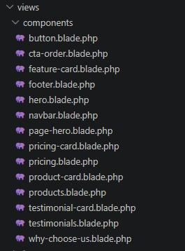
---
7. User Interface Design
Color Palette
The C'Bites interface uses a warm and friendly color palette that matches the homemade bakery theme. The colors are kept limited and consistent so the page feels cohesive rather than overly decorated.
Typography
Typography is kept readable with clear differences between headings, body text, labels, and call-to-action buttons. Larger headings are used to guide the user's attention, while body text remains easy to read.
Iconography
Icons are used only where they support understanding, such as contact information, social links, product details, or feature highlights. The goal is to keep the design clean instead of overcrowding sections.
Button Styles
Primary call-to-action buttons are designed to stand out from regular content. Rounded corners, readable labels, spacing, and hover states help users understand that the elements are clickable.
Card Design
Cards are used for grouped information such as product features, pricing or packages, and testimonials. Their spacing, border radius, and shadows are kept consistent.
Layout Consistency
Consistent spacing, alignment, typography, and section widths are used throughout the page. This helps visitors scan the page more easily and makes the website feel more professional.
---
8. Folder Structure
Recommended project structure:
```text
week05-product-landing-page/
│
├── app/
│
├── public/
│   └── images/
│
├── resources/
│   └── views/
│       ├── layouts/
│       │   └── app.blade.php
│       │
│       ├── components/
│       │   ├── navbar.blade.php
│       │   ├── hero.blade.php
│       │   ├── feature-card.blade.php
│       │   ├── pricing-card.blade.php
│       │   ├── testimonial-card.blade.php
│       │   ├── button.blade.php
│       │   └── footer.blade.php
│       │
│       └── pages/
│           └── home.blade.php
│
├── screenshots/
│   ├── desktop-view.png
│   ├── tablet-view.png
│   ├── mobile-view.png
│   ├── navbar.png
│   ├── hero-section.png
│   ├── features-section.png
│   ├── pricing-section.png
│   ├── testimonials.png
│   ├── footer.png
│   ├── project-structure.png
│   ├── blade-components-folder.png
│   └── github-repository.png
│
├── documentation/
│   ├── before-design.png
│   └── after-design.png
│
└── README.md
```
Folder Purposes
`resources/views/layouts` – contains the main reusable page layout.
`resources/views/components` – contains reusable Blade UI components.
`resources/views/pages` – contains page-level Blade views.
`public` – contains publicly accessible images and other frontend assets.
`screenshots` – contains screenshots required for documentation.
`documentation` – contains the before-and-after comparison images.
`README.md` – contains the complete technical documentation of the project.
---
9. Screenshots
> Replace the image files below with actual screenshots from the finished project.
Desktop View
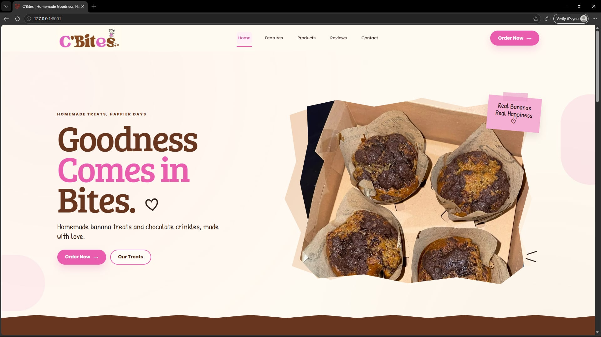
Tablet View
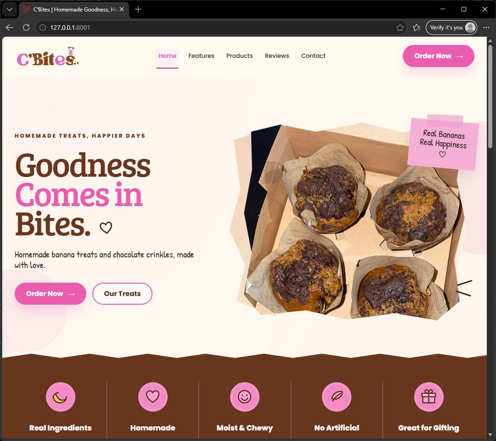
Mobile View
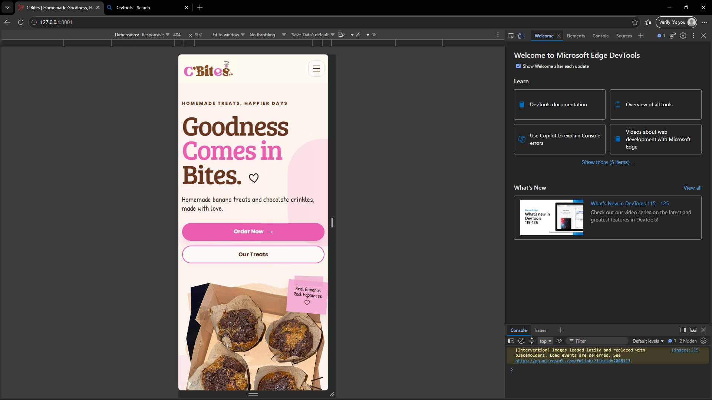
Navigation Bar
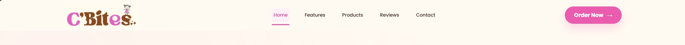
Hero Section
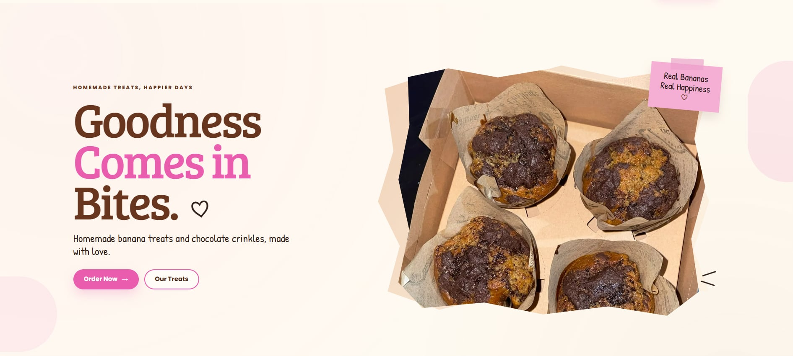
Features Section
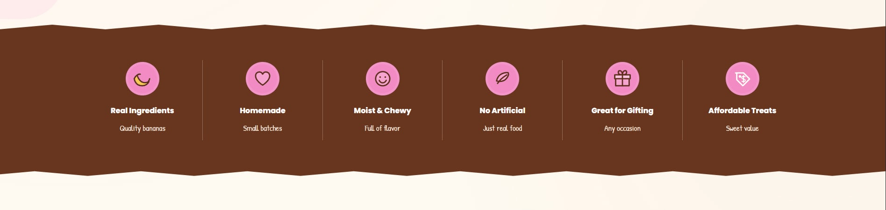
Pricing / Packages Section
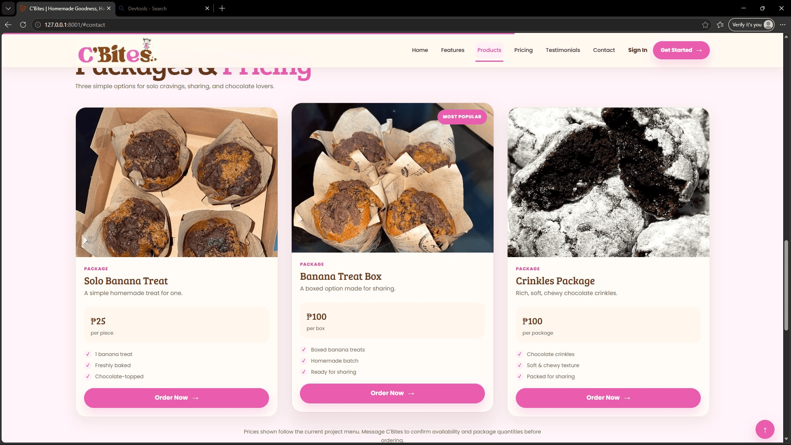
Testimonials
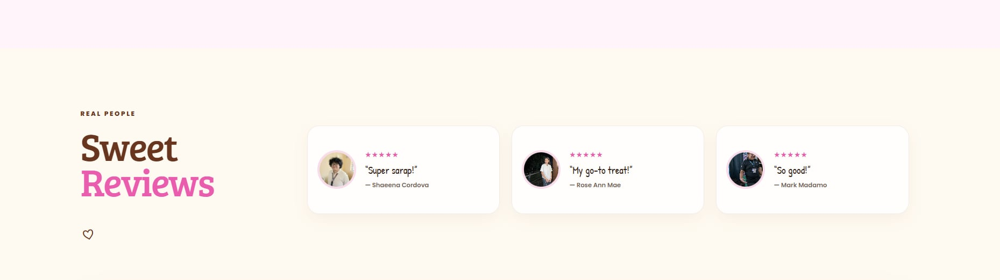
Footer
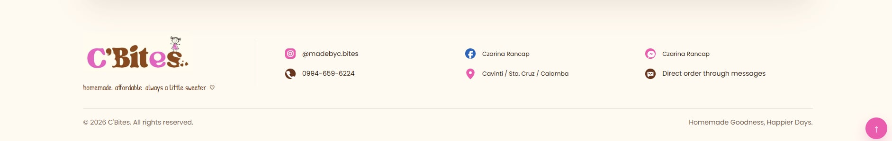
VS Code Project Structure
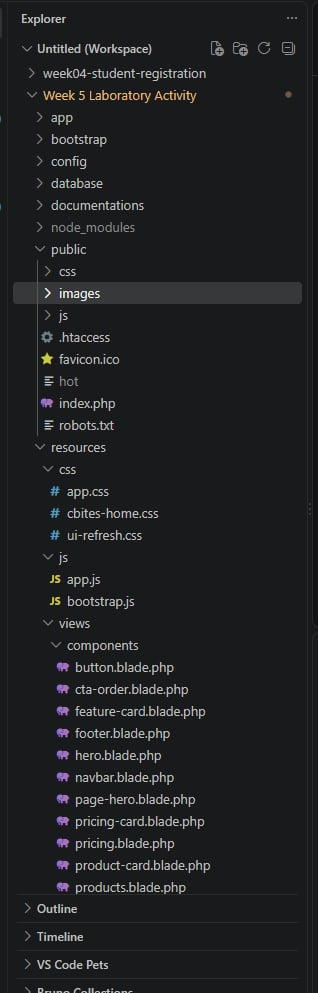
Blade Components Folder

GitHub Repository
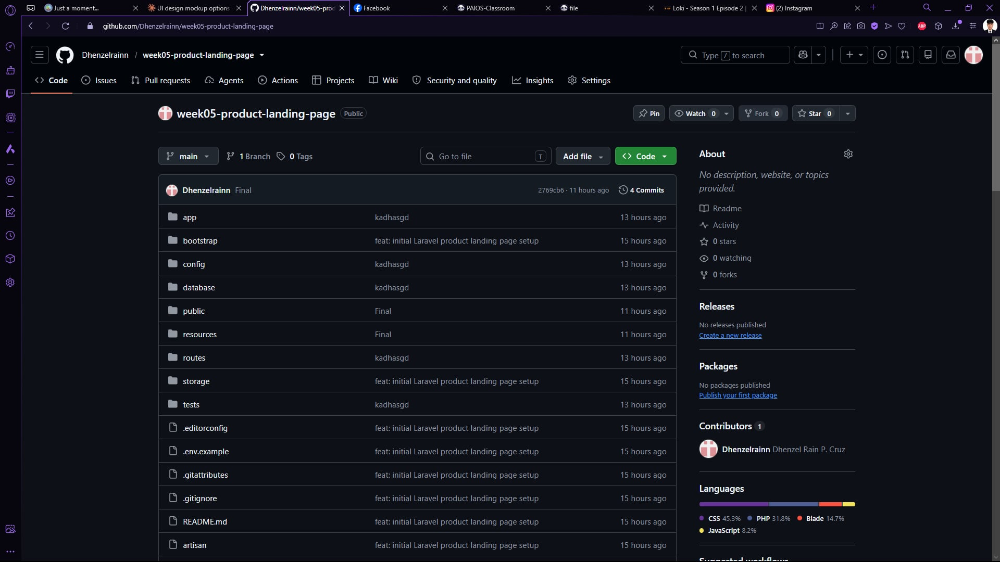
---
10. Before-and-After Comparison
Before
The initial version focused mainly on arranging the basic content and page sections. It established the general structure of the landing page but still needed improvements in visual hierarchy, responsiveness, spacing, and reusable component organization.

After
The final version improves the visual hierarchy, responsive behavior, typography, spacing, component consistency, and overall usability. The polished interface better represents the C'Bites brand and provides a clearer experience for visitors across different screen sizes.

---
11. Problems Encountered and Solutions
Problem 1: Keeping the design responsive
Some layouts can look correct on desktop but become crowded on smaller screens.
Solution: Responsive Tailwind breakpoints, flexible widths, Flexbox, and Grid layouts are used so sections can reorganize properly on tablets and mobile phones.
Problem 2: Repeated interface code
Repeating the same card or button markup makes the project harder to maintain.
Solution: Reusable Blade Components are used for repeated UI elements such as buttons, feature cards, pricing cards, testimonials, navigation, and the footer.
Problem 3: Maintaining consistent styling
Different sections can look disconnected when spacing, button styles, card radius, and typography are inconsistent.
Solution: Shared Tailwind utility patterns and reusable components are used to keep the design consistent.
Problem 4: Organizing project assets
Images and screenshots can become difficult to manage when stored in random locations.
Solution: Website assets are kept inside `public`, project screenshots are stored in `screenshots`, and before-and-after images are stored in `documentation`.
---
12. Reflection
This activity helped me better understand how responsive design and reusable components can improve both the user interface and the code structure of a Laravel project. I also learned how Tailwind CSS, Blade Components, Flexbox, and Grid can work together to create an interface that is easier to maintain and use on different devices.
Transforming a real business into a landing page also helped me think more carefully about how visual design, content organization, and calls to action affect the overall user experience.
---
13. Technologies Used
Laravel
Blade Templates
Laravel Blade Components
Tailwind CSS
HTML
JavaScript
Git
GitHub
---
14. Installation and Setup
Clone the repository:
```bash
git clone https://github.com/Dhenzelrainn/week05-product-landing-page.git
```
Open the project folder:
```bash
cd week05-product-landing-page
```
Install PHP dependencies:
```bash
composer install
```
Install frontend dependencies:
```bash
npm install
```
Create the environment file:
```bash
copy .env.example .env
```
Generate the application key:
```bash
php artisan key:generate
```
Run the frontend development server:
```bash
npm run dev
```
In another terminal, run Laravel:
```bash
php artisan serve
```
Then open the local Laravel URL shown in the terminal.
---
15. GitHub Repository
Repository:
https://github.com/Dhenzelrainn/week05-product-landing-page
The repository should remain Public and should contain at least 10 meaningful commits before submission.
---
16. Author
Dhenzel Rain Cruz  
ITST 302 – Client-Server Technologies  
Week 5 Laboratory Activity